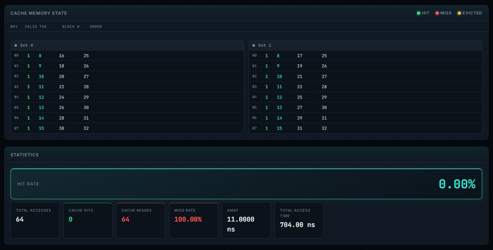
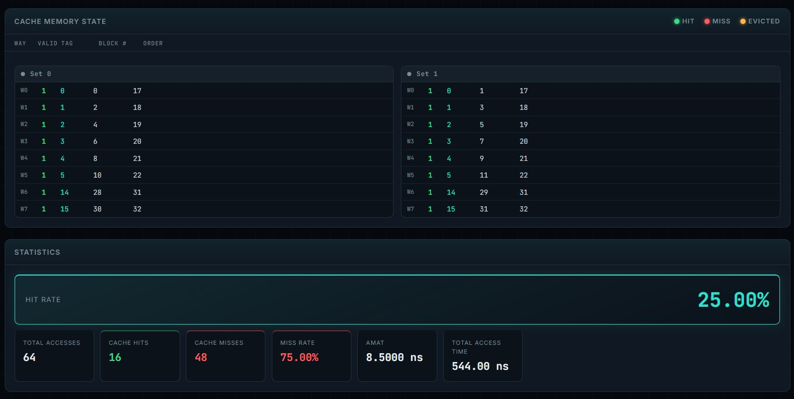
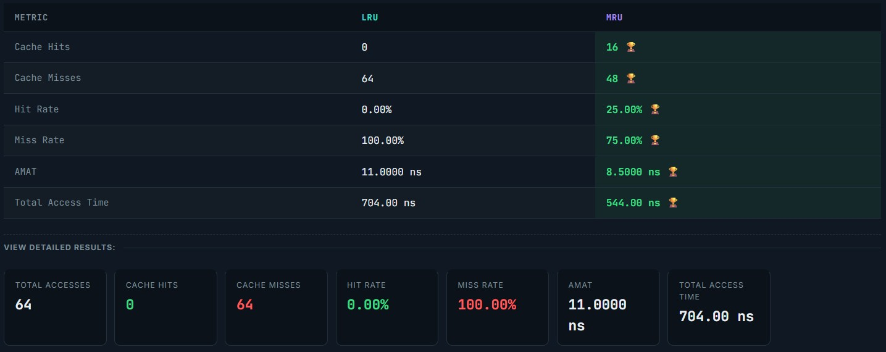
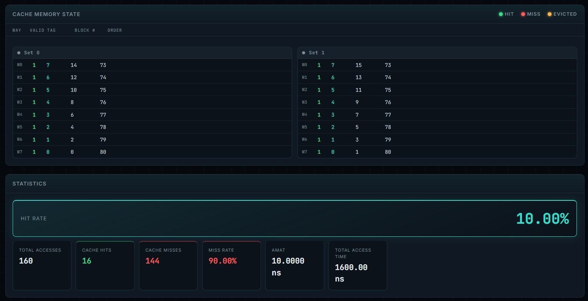
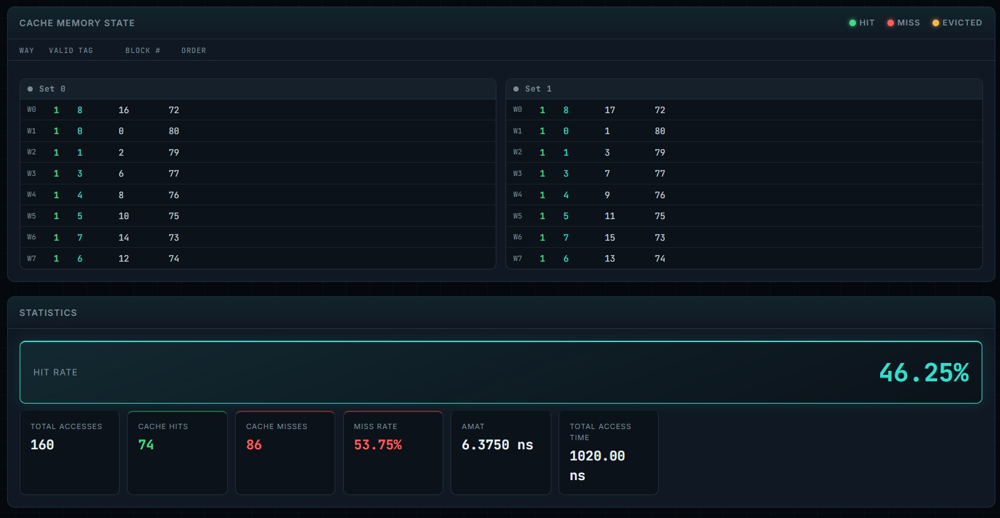
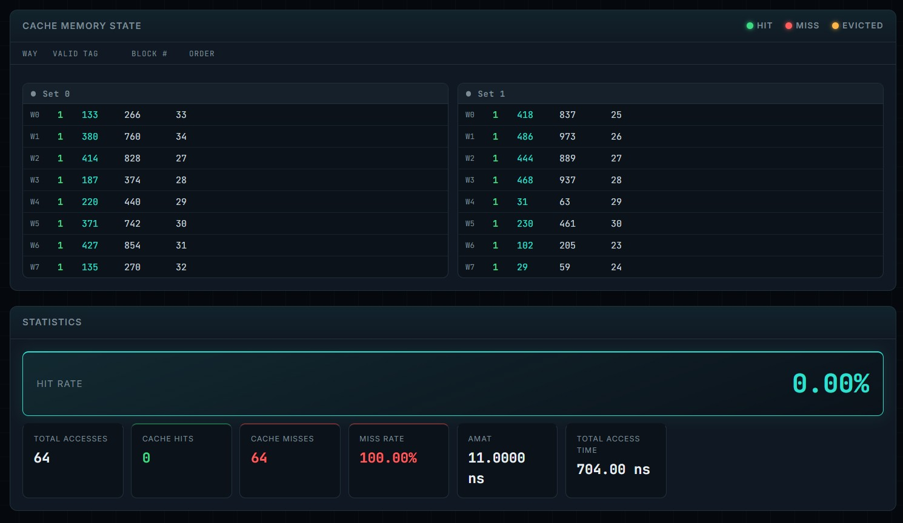
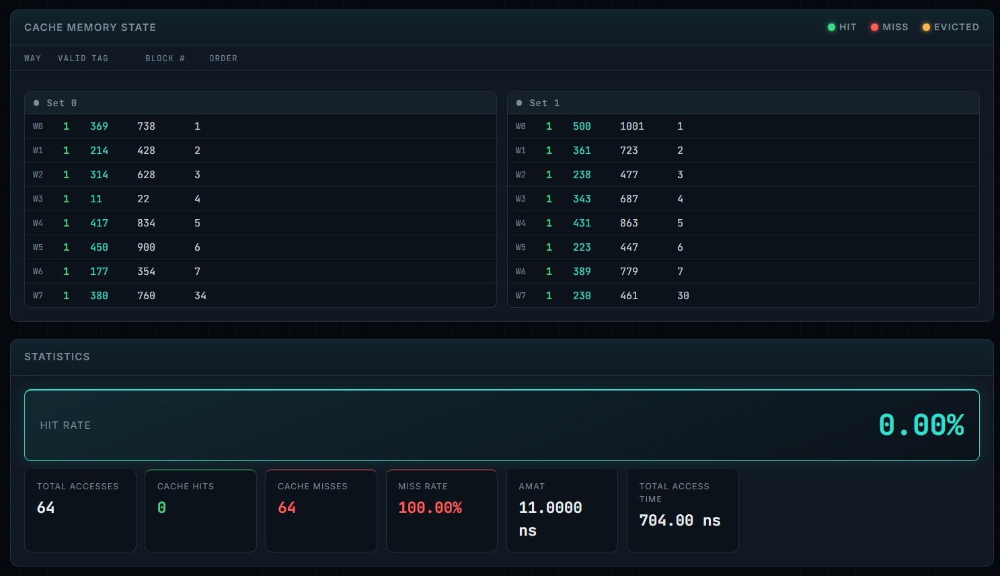
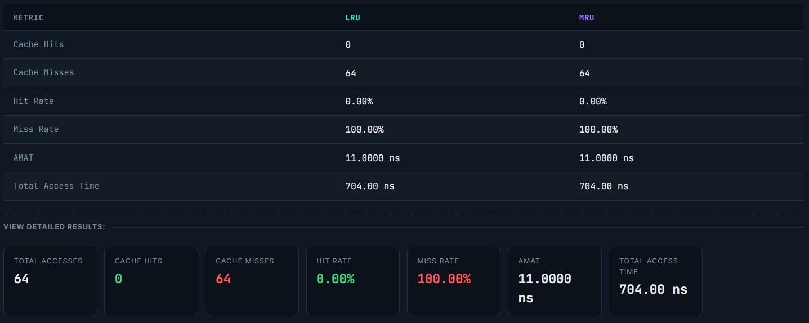

# CSARCH2 Cache Memory Simulation (Machine 9)
### 3rd Term AY 2025-2026 | S05 Group 9
---

### Members
| Name | GitHub |
| :--- | :--- |
| Dabuit, Daniel Jedrick C. | [@danueli](https://github.com/danueli) |
| Go, John William D. | [@johnwilliam-go](https://github.com/johnwilliam-go) |
| Liwanag, Ram Miguel C. | [@Rammy-errorlol](https://github.com/Rammy-errorlol) |
| Lobo, Shirley Marie A. | [@SAM-lvl1](https://github.com/SAM-lvl1) |
| Uy, Tara Ysabel P. | [@tartar121](https://github.com/tartar121) |

---

## Project Overview
This web-based application simulates and compares two cache operations for an **8-Way Block Set Associative (BSA)** cache memory system:
1. **8-Way BSA + Least Recently Used (LRU)**
2. **8-Way BSA + Most Recently Used (MRU)**

The simulator provides step-by-step memory trace animation, real-time cache layout updates, detailed cache statistics, and side-by-side performance comparisons.

---

## Live Deployment & Demo
* **Live Website:** https://tartar121.github.io/CSARCH2-8Way-BSA-Cache-Simulator/ 
* **Video Walkthrough:** https://youtu.be/SI4n3cvkxeU

---

## Cache Simulation Specifications
* **Main Memory Size:** Fixed at 1024 blocks (Block numbers 0–1023)
* **Block Size:** Parameterized (Power of 2, minimum 2 words)
* **Number of Cache Blocks ($n$):** Parameterized (Power of 2, minimum 4 blocks)
* **Read Policy:** Parameterized (**Load-Through** / **Non-Load-Through**)
* **Associativity:** 8-Way Set Associative
  * $\text{Total Sets} = \frac{n}{8}$
  * $\text{Set Index} = \text{Block Number} \pmod{\text{Total Sets}}$
  * $\text{Tag} = \left\lfloor \frac{\text{Block Number}}{\text{Total Sets}} \right\rfloor$

---

## Output Metrics Computed
1. Total Memory Access Count
2. Cache Hit Count & Cache Miss Count
3. Cache Hit Rate (%) & Cache Miss Rate (%)
4. Average Memory Access Time (AMAT)
5. Total Memory Access Time

---

## Test Case Specifications

Let **n** = total number of cache blocks.

### Test Case A: Sequential Sequence
Access blocks `0` to `2n−1`, then repeat the full range once more.

Example (n = 4): 0, 1, 2, 3, 4, 5, 6, 7, 0, 1, 2, 3, 4, 5, 6, 7
Total accesses: 4n

### Test Case B: Mid-Repeat Blocks
1. `0` to `n−1`
2. `0` to `2n−1` × 2
3. Reverse: `n−1` to `0`
4. Reverse: `2n−1` to `0` × 2

Example (n = 4):
0, 1, 2, 3,
0, 1, 2, 3, 4, 5, 6, 7, 0, 1, 2, 3, 4, 5, 6, 7,
3, 2, 1, 0,
7, 6, 5, 4, 3, 2, 1, 0, 7, 6, 5, 4, 3, 2, 1, 0

### Test Case C: Random Sequence
64 randomly generated block addresses in the range `[0, 1023]`.

---

## Architectural Analysis & Test Case Results

> **Note:** The following results were obtained using the default configuration:
> `n = 16 cache blocks | 8-way | 2 sets | Block size = 4 words | Non-Load-Through`

---

### Test Case A: Sequential Sequence

#### Parameters Used
| Parameter | Value |
| :--- | :--- |
| Number of Cache Blocks (n) | 16 |
| Block Size | 4 words |
| Number of Sets | 2 |
| Read Policy | Non-Load-Through |

#### LRU Results
| Metric | Value |
| :--- | :--- |
| Total Accesses | 64 |
| Cache Hits | 0 |
| Cache Misses | 64 |
| Hit Rate | 0.00% |
| Miss Rate | 100.00% |
| AMAT | 11.0000 ns |
| Total Memory Access Time | 704.00 ns |

#### MRU Results
| Metric | Value |
| :--- | :--- |
| Total Accesses | 64 |
| Cache Hits | 16 |
| Cache Misses | 48 |
| Hit Rate | 25.00% |
| Miss Rate | 75.00% |
| AMAT | 8.5000 ns |
| Total Memory Access Time | 544.00 ns |

#### Screenshots
| LRU Final Snapshot | MRU Final Snapshot |
| :---: | :---: |
|  |  |

#### Compare Policies


#### Discussion

The sequential test accesses blocks **0 to 31** twice in order. Since the cache can only hold 16 cache blocks, it cannot store the entire sequence at once. As new blocks are loaded, older ones have to be removed to make space.

For **LRU**, every access results in a cache miss, giving a **0.00%** hit rate. Because the sequence continuously moves forward, blocks that were loaded earlier are removed before they are needed again. When the second pass begins, none of the previously accessed blocks remain in the cache, so every access is another miss.

MRU performs better, achieving **16 cache hits** and a **25.00% hit rate**. By removing the most recently used block instead of the least recently used one, MRU keeps some of the older blocks in the cache long enough to be reused during the second pass. As a result, it produces fewer misses, a lower AMAT, and a shorter total memory access time than LRU for this sequential access pattern.

---

### Test Case B: Mid-Repeat Blocks

#### Parameters Used
| Parameter | Value |
| :--- | :--- |
| Number of Cache Blocks (n) | 16 |
| Block Size | 4 words |
| Number of Sets | 2 |
| Read Policy | Non-Load-Through |

#### LRU Results
| Metric | Value |
| :--- | :--- |
| Total Accesses | 160 |
| Cache Hits | 16 |
| Cache Misses | 144 |
| Hit Rate | 10.00% |
| Miss Rate | 90.00% |
| AMAT | 10.0000 ns |
| Total Memory Access Time | 1600.00 ns |

#### MRU Results
| Metric | Value |
| :--- | :--- |
| Total Accesses | 160 |
| Cache Hits | 74 |
| Cache Misses | 86 |
| Hit Rate | 46.25% |
| Miss Rate | 53.75% |
| AMAT | 6.3750 ns |
| Total Memory Access Time | 1020.00 ns |

#### Screenshots
| LRU Final Snapshot | MRU Final Snapshot |
| :---: | :---: |
|  |  |

#### Compare Policies


#### Discussion

The mid-repeat sequence contains several repeated forward and reverse passes through the same range of memory blocks. Because many blocks are accessed again later in the sequence, the replacement policy has a greater effect on cache performance.

With LRU, the cache records only **16 hits** out of **160 accesses**, resulting in a **10.00% hit rate**. During the repeated forward passes, many previously stored blocks are evicted to make room for newer ones. When the sequence later accesses those earlier blocks again in reverse order, they are no longer in the cache, causing many additional misses.

MRU performs much better, achieving **74 hits** and a **46.25% hit rate**. Since MRU removes the most recently used block, many older blocks remain in the cache and can be reused during the repeated and reversed portions of the sequence. This leads to significantly fewer cache misses, a lower AMAT, and about 580 ns less total memory access time compared to LRU. For this access pattern, MRU is clearly the more effective replacement policy.

---

### Test Case C: Random Sequence (64 Block Accesses)

#### Parameters Used
| Parameter | Value |
| :--- | :--- |
| Number of Cache Blocks (n) | 16 |
| Block Size | 4 words |
| Number of Sets | 2 |
| Read Policy | Non-Load-Through |

#### Sequence Used
738, 1001, 723, 477, 687, 863, 428, 447, 628, 779, 22, 834, 327, 900, 354, 579, 634, 460, 178, 556, 326, 664, 247, 76, 932, 613, 996, 517, 793, 95, 418, 162, 870, 189, 924, 796, 761, 239, 553, 327, 234, 500, 144, 368, 299, 256, 131, 429, 828, 205, 59, 374, 837, 440, 742, 973, 854, 270, 889, 937, 63, 266, 461, 760

#### LRU Results
| Metric | Value |
| :--- | :--- |
| Total Accesses | 64 |
| Cache Hits | 0 |
| Cache Misses | 64 |
| Hit Rate | 0.00% |
| Miss Rate | 100.00% |
| AMAT | 11.0000 ns |
| Total Memory Access Time | 704.00 ns |

#### MRU Results
| Metric | Value |
| :--- | :--- |
| Total Accesses | 64 |
| Cache Hits | 0 |
| Cache Misses | 64 |
| Hit Rate | 0.00% |
| Miss Rate | 100.00% |
| AMAT | 11.0000 ns |
| Total Memory Access Time | 704.00 ns |

#### Screenshots
| LRU Final Snapshot | MRU Final Snapshot |
| :---: | :---: |
|  |  |

#### Compare Policies


#### Discussion

The random test case consists of **64 randomly generated memory block accesses** between **0 and 1023**. Because the addresses are chosen randomly, there is very little opportunity for the cache to reuse previously loaded blocks.

For the generated sequence, both **LRU and MRU** produced the same results: **0 cache hits** and **64 cache misses**, giving a **0.00% hit rate** and an AMAT of **11.0000 ns**. Most memory blocks are accessed only once, so the cache rarely contains the block that will be requested next.

This test case shows that when memory accesses do not follow any recognizable pattern, the choice of replacement policy has little effect on performance. Since there is almost no data reuse, neither LRU nor MRU has an advantage.

---

## Overall Comparison Summary

| Metric | Sequential | Mid-Repeat | Random |
| :--- | :---: | :---: | :---: |
| Better Policy | **MRU** | **MRU** | **Equal** |
| LRU Hit Rate | 0.00% | 10.00% | 0.00% |
| MRU Hit Rate | 25.00% | 46.25% | 0.00% |
| LRU AMAT | 11.0000 ns | 10.0000 ns | 11.0000 ns |
| MRU AMAT | 8.5000 ns | 6.3750 ns | 11.0000 ns |

### Overall Conclusion

The results show that **MRU performed better than LRU** for the first two test cases using the default cache configuration. In both the sequential and mid-repeat sequences, MRU achieved higher cache hit rates, lower miss rates, lower AMAT, and shorter total memory access times. This is because these access patterns repeatedly revisit older blocks, which MRU tends to keep in the cache longer.

For the random sequence, both replacement policies performed the same because the memory accesses had almost no repetition. Without repeated accesses, neither policy could make better replacement decisions, resulting in identical performance.

Overall, this project demonstrates that the **best cache replacement policy depends on the memory access pattern**. Although LRU is commonly used because it works well for many workloads, it is not always the best choice. In the access patterns tested for Machine 9, **MRU provided better performance in the sequential and mid-repeat test cases, while both policies performed equally in the random test case**. These results show that different memory access patterns can favor different cache replacement strategies.

---

## How to Run Locally

No build step is required. Open `index.html` directly in any browser.

```bash
# Option 1: open the file directly
open index.html

# Option 2: serve locally to avoid any issues
python3 -m http.server 8080
# then visit http://localhost:8080
```

### Deploy to GitHub Pages
1. Push the repository to GitHub.
2. Go to **Settings → Pages → Source** → select `main` branch, `/ (root)`.
3. Copy the generated URL and paste it into the Live Deployment section above.

---

*CSARCH2 · S05 Group 9 · 3rd Term AY 2025–2026*
